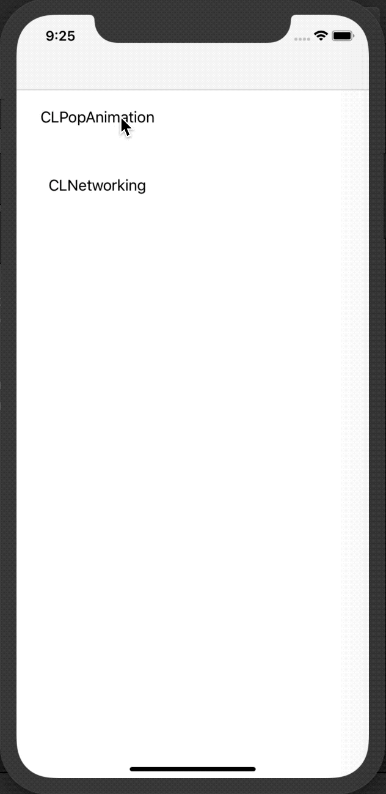

# this kit just save your time
### Target Support iOS 8
### You can pod install with cocoapods

```
pod 'CLKits', '~> 1.0.4'
	or   
pod 'CLKits/CLFaster', '~> 1.0.4'
pod 'CLKits/CLNetworking', '~> 1.0.4'
pod 'CLKits/CLPopAnimation', '~> 1.0.4'
pod 'CLKits/JKDBModel', '~> 1.0.4'
pod 'CLKits/CLHUD', '~> 1.0.4'
```

### CLHUD
use: [SVProgressHUD](https://github.com/SVProgressHUD/SVProgressHUD) , [FTIndicator](https://github.com/liufengting/FTIndicator)

```
pod 'CLKits/CLHUD', '~> 1.0.4'
```

```
typedef enum : NSUInteger {
    CLHUDDark,
    CLHUDLight
} CLHUDStyleType;

@interface CLHUD : NSObject

+(void)setStyle:(CLHUDStyleType)type;

+(void)showCL:(UIView *)view;
+(void)hideCL;

+(void)showSV;
+(void)hideSV;

+(void)showToast:(NSString *)msg;
+(void)showInfo:(NSString *)msg;
+(void)showNotification:(NSString *)title msg:(NSString *)msg;

@end
```
<figure class="four">
	
	
	
	
</figure>

<figure class="third">
	
	
	
</figure>


### JKDBModel
fork with: [JKDBModel](https://github.com/Joker-King/JKDBModel)
, use: [FMDB](https://github.com/ccgus/fmdb)

```
pod 'CLKits/JKDBModel', '~> 1.0.4'
```

```
@interface User : JKDBModel

@property(nonatomic,strong)NSString *userName;

@end

//easy to use:
{
	User *user = [User new];
	user.pk = 2;
	user.userName = @"hello2";
	[user saveOrUpdate];
	    
	NSLog(@"users = %@",[User findAll]);
}
```


### CLNetworking
use [AFNetworking](https://github.com/AFNetworking/AFNetworking)

```
pod 'CLKits/CLNetworking', '~> 1.0.4'
```
```
@interface CLNetworking : NSObject

+ (id)sharedInstance;

-(void)getData:(NSString *)url params:( NSDictionary * _Nullable)params successBlock:(void(^)(id result))successBlock failBlock:(void(^)(id result))failBlock;

-(void)postData:(NSString *)url params:(NSDictionary * _Nullable)params successBlock:(void(^)(id result))successBlock failBlock:(void(^)(id result))failBlock;

-(void)getJson:(NSString *)url params:(NSDictionary * _Nullable)params successBlock:(void(^)(id result))successBlock failBlock:(void(^)(id result))failBlock;

-(void)postJson:(NSString *)url params:(NSDictionary * _Nullable)params successBlock:(void(^)(id result))successBlock failBlock:(void(^)(id result))failBlock;

-(void)upload:(NSString *)url datas:(NSArray *)datas fileName:(NSString *)fileName parameters:(NSDictionary * _Nullable)params successBlock:(void(^)(id result))successBlock failBlock:(void(^)(id result))failBlock progressBlock:(void(^)(NSProgress *progress))progressBlock;

-(void)download:(NSString *)url fileName:(NSString *)fileName successBlock:(void(^)(NSURL *result))successBlock failBlock:(void(^)(NSError *result))failBlock progressBlock:(void(^)(NSProgress *progress))progressBlock;

-(void)soap:(NSString *)soapXmlString url:(NSString *)url user:(NSDictionary *)user successBlock:(void(^)(id result))successBlock failBlock:(void(^)(id result))failBlock;

@end
```

### CLPopAnimation
use [pop](https://github.com/facebook/pop)

```
pod 'CLKits/CLPopAnimation', '~> 1.0.4'
```
```

@interface UIView (CLPopAnimation)

-(void)cl_line:(UIColor *)color width:(float)width points:(NSArray *)points;
-(void)circle:(float)radius lineWidth:(CGFloat)lineWidth color:(UIColor *)strokeColor;

-(void)cl_fadeIn;
-(void)cl_fadeIn:(nullable void(^)(void))block;

-(void)cl_fadeOut;
-(void)cl_fadeOut:(nullable void(^)(void))block;

-(void)cl_show;
-(void)cl_show:(nullable void(^)(void))block;

-(void)cl_hide;
-(void)cl_hide:(nullable void(^)(void))block;

-(void)cl_jelly;
-(void)cl_jelly:(nullable void(^)(void))block;

-(void)cl_shake;
-(void)cl_shake:(nullable void(^)(void))block;

-(void)cl_move:(NSValue *)point,... NS_REQUIRES_NIL_TERMINATION;
-(void)cl_move:(void(^)(void))block point:(NSValue *)point,... NS_REQUIRES_NIL_TERMINATION;

-(void)cl_springMove:(NSValue *)point,... NS_REQUIRES_NIL_TERMINATION;
-(void)cl_springMove:(void(^)(void))block point:(NSValue *)point,... NS_REQUIRES_NIL_TERMINATION;

@end
```

